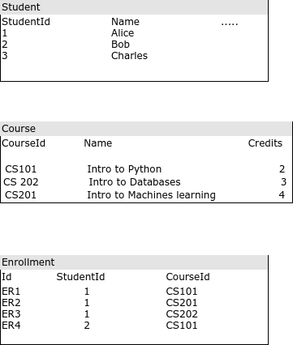
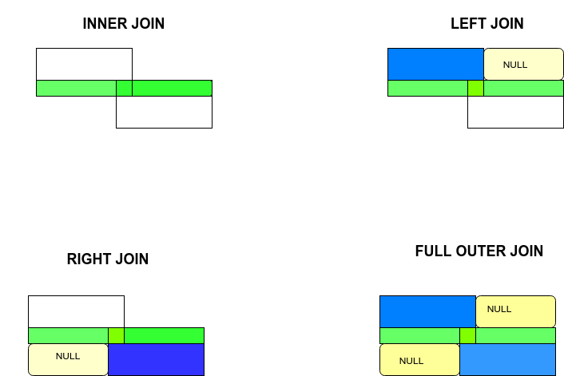

The **JOIN** operator tells how to combine different tables in SQL. It's a simple and yet powerful concept that requires some time to get used to. Most explanations online  describe SQL joins as Venn diagrams, like [here](http://www1.udel.edu/evelyn/SQL-Class2/SQLclass2_Join.html), but I find these confusing for so many reasons. SQL has its own versions of set operations (UNION, INTERSECT and EXCEPT). These operations are closer to the Venn diagrams than JOIN.

More importantly, these Venn diagrams represent simple set operations that combine from similar datasets multiple tables (sets). The individual elements of the set usually have identical structure. In SQL, that would translate to tables with identical schema. That is not what JOINs do, and very often this is misleading. For example, the following Venn diagram that is often used to describe INNER JOIN, actually represents a set intersection.

<br/><br/><br/>
 
<br/><br/><br/>

The above Venn diagram conveys that an INNER JOIN fetches rows that are present in both the tables. But JOINS are much more powerful and they don't work on sets but on [cartesian products](https://en.wikipedia.org/wiki/Cartesian_product) of sets.

### What are JOINS?

Joins are simply cartesian products with a filter. The different kinds of joins determine the different ways of filtering the set of cartesian product of two tables.

Consider the following tables that represent the students and their courses in a semester at a fictional university. The schema is not ideal but it works as an example to understand JOINs

<br/><br/><br/>
 
<br/><br/><br/>


From the above table, suppose we need to find all the students who have taken a course in the semester. A simple query using INNER JOIN would yield.

```sql
SELECT DISTINCT student.name FROM student
    INNER JOIN enrollment ON enrollment.student_id = student.student_id;
```

The above query only selects students who have taken at least one course. Joining the two tables works on the cross product of the `student` and the `enrollment` tables, i.e., all possible combinations of student-enrollment record pairs. The clause after `ON` filters out only the records where student_id matches between the columns.

We used an `INNER JOIN` in the above query. `INNER JOIN` selects only the student-enrollment pairs where both student row and the enrollment row are not null. In general for a if `A` and `B` are tables, then `A` INNER JOIN `B` will only have records (a,b) where a is selected from `A` and b from `B`, such that both `a` and `b` are not null.
This is different from a `LEFT JOIN` where `b` can be null and a right join where `a` can be null.


For example, the following query

```sql
SELECT * FROM student
    INNER JOIN enrollment ON enrollment.student_id = student.student_id;
```
would return a result as

```
1|Alice|1|CS101|1
1|Alice|2|CS201|1
2|Bob|3|CS101|2
```


while the query below
```sql
SELECT *
    LEFT JOIN enrollment ON enrollment.student_id = student.student_id;
```

yields

```
1|Alice|1|CS101|1
1|Alice|2|CS201|1
2|Bob|3|CS101|2
3|Charles|||
```


To fetch all the students who took `Intro to Python`, one can use `INNER JOIN` or `LEFT JOIN`,

```sql
SELECT student.name, student.student_id FROM student
    INNER JOIN enrollment ON enrollment.student_id = student.student_id
    INNER JOIN course ON course.course_id = enrollment.course_id
    WHERE course.name = 'Intro to Python';
```

### Better Venn Diagrams?


Now that we know what they do, maybe we can build better pictorial representations to represent JOINS.

Since we are working with tables, let's build Venn Diagrams with rectangles instead of circles.

Let's assume two tables where both tables have columns that store the same data, (similar to student_id columns in `student` and `enrollment` tables in our example). Something like


<br/><br/><br/>
 
<br/><br/><br/>

The orange region represents the values in the shared column that are present in both the tables.


Then maybe a better representation for joins would be


<br/><br/><br/>
 
<br/><br/><br/>


The green portions correspond to rows in the tables where the shared column values match. In our `student-enrollment` example, this would represent rows in student and enrollment tables where the student_id is present in both the tables(student_id 1 and 2).

The blue regions are rows where the shared column has no corresponding value in the other table. When doing a `LEFT JOIN` or a `RIGHT JOIN` these match with null values.

### Further Reading

* [A better explanation with nicer pictures](https://learnsql.com/blog/sql-joins-types-explained/)
* [A Mathematical explanation](https://math.stackexchange.com/a/3664118)